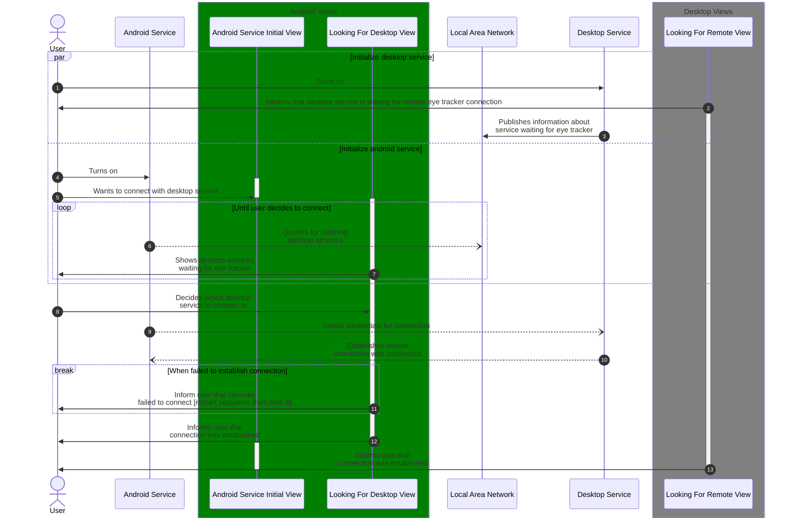
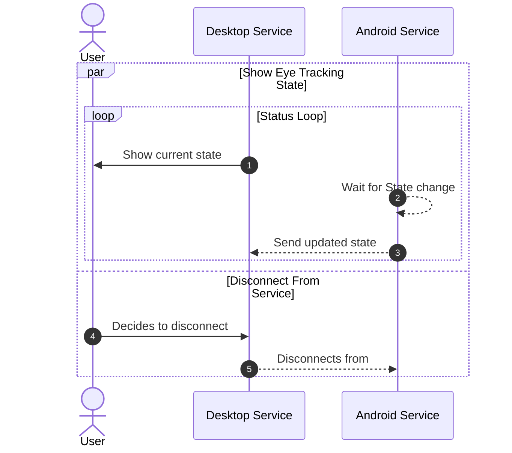

# About

This document describes user and system sequence diagram.
Diagrams include behavior of the user and both presentation layer and business layer of all the systems taking part in communication.
Solid arrows represent communication between user and applications parts.
Dotted arrow signify communication between and within applications. 

## System initialization

**Goal: connect eye tracker with desktop service and make it manageable through desktop service**

## System information

**Goal: provide user with information about eye tracker state, allow initiating calibration, allow user to disconnect from service**

