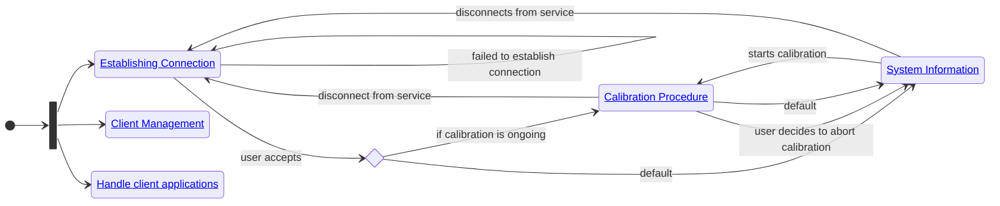
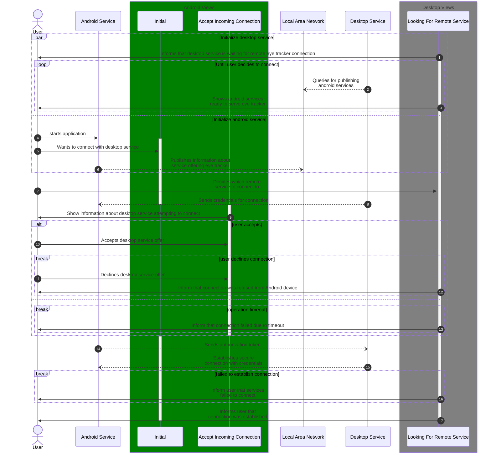
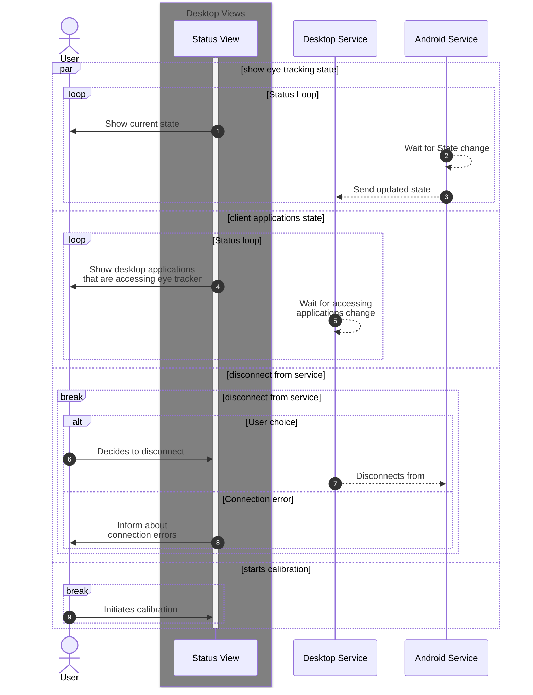
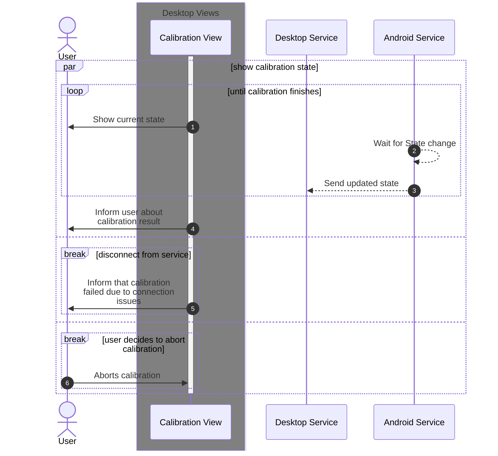
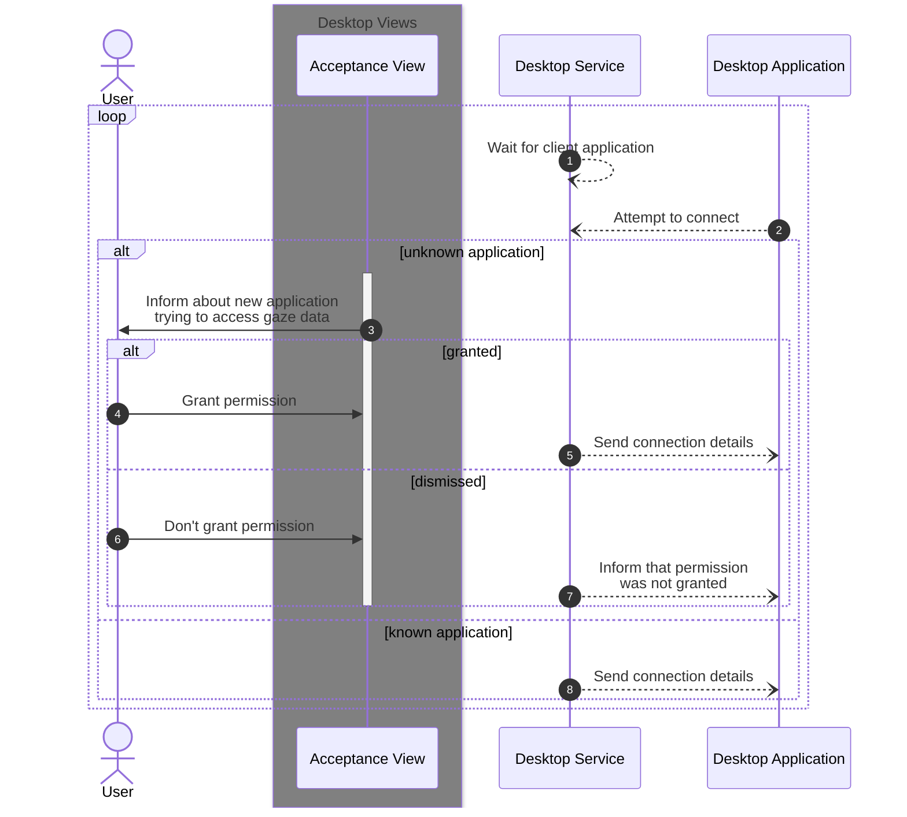
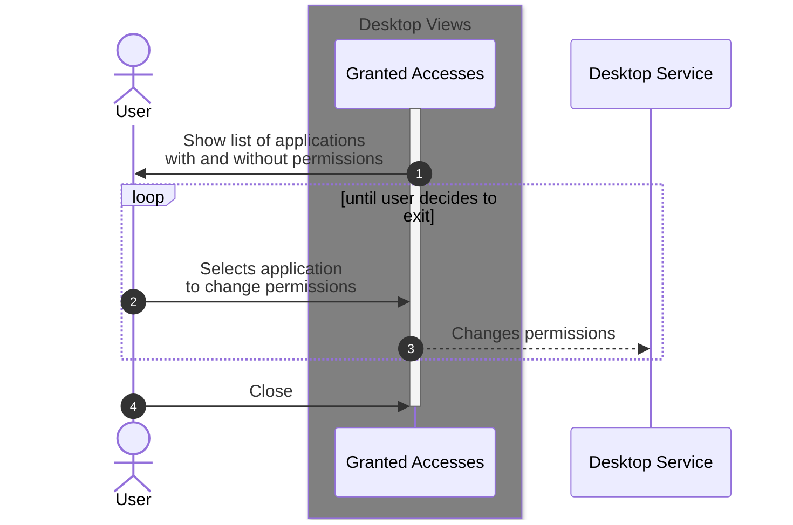

# System state diagram

*created by [Mateusz Chojnowski](mailto:mateusz.chojnowski@inseye.com)*

This document describes user and system sequence diagram.
Diagrams include behavior of the user and both presentation layer and simplified business layer of all the systems taking part in communication.
Solid arrows represent communication between user and applications parts.
Dotted arrow signify communication between and within systems.

# Big picture

## Establishing connection

**Goal: connect eye tracker with desktop service and make it manageable through desktop service**

Parties:
  + User: VR headset/desktop service end user
  + Android Service: application on android device that manages eye tracker and makes data accessible remotely
    + Initial: view after loading the application
    + Accept Incoming Connection: popup/view that will allow user accept incoming service connection
  + Desktop Service: Windows application that communicates with Android Service and provides gaze data access to desktop applications
    + Looking For Remote Service: view that allow user connect to remote service

## System information

**Goal: provide user with information about eye tracker state, allow initiating calibration, allow user to disconnect from service, show what client applications are using eye tracking data currently**

Parties:
  + User: VR headset/desktop service end user
  + Android Service: application on android device that manages eye tracker and makes data accessible remotely
  + Desktop Service: Windows application that communicates with Android Service and provides gaze data access to desktop applications
    + Status view: view that allows user to get information about current system state 

State:
- eye tracker state
- remote service name and address
- list of desktop client applications waiting for eye tracker data

## Calibration procedure

**Goal: Inform user about current calibration state, allow user cancelling ongoing calibration**

Parties:
  + User: VR headset/desktop service end user
  + Android Service: application on android device that manages eye tracker and makes data accessible remotely
  + Desktop Service: Windows application that communicates with Android Service and provides gaze data access to desktop applications
    + Calibration view: shows current state of calibration (in progress, finished successfully, finished failed), allows user to abort ongoing calibration

## Handle client applications

**Goal: allow user respond to desktop applications that attempts to access gaze data**

Parties:
  + User: VR headset/desktop service end user
  + Desktop application: application on desktop that connects to desktop service to gain access to eye tracking data
  + Desktop Service: Windows application that communicates with Android Service and provides gaze data access to desktop applications
    + Acceptance View: view/popup that shows in response to client application that neither have already been granted or revoked permissions to access gaze data

## Client management
**Goal: allow user to access information on which desktop applications have granted access to gaze data, revoke existing permissions**

Parties:
  + User: VR headset/desktop service end user
  + Desktop Service: Windows application that communicates with Android Service and provides gaze data access to desktop applications
    + Granted Accesses: list of applications that had been granted or revoked permissions to access gaze data 

